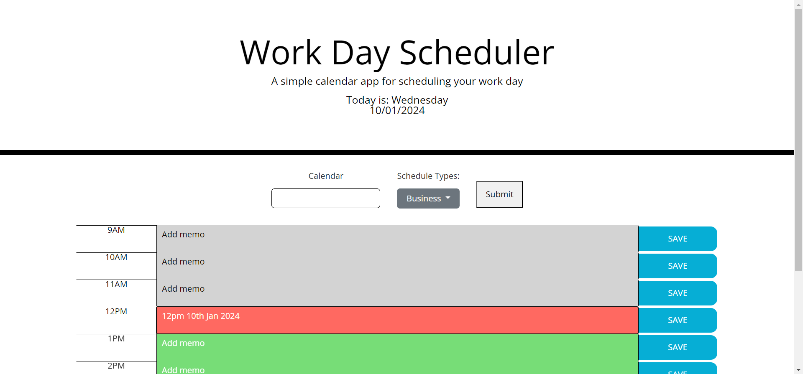

# Work Day Scheduler

## Description

This project was created to create a work day scheduling app. The aim was to able to store notes for each hour of the day and be able add notes for future dates or look back at past notes. The project meets the following criteria:

* On loading/refreshing the page, the business hours for the current day is shown.
* Any saved information is loaded if it exists.
* Any past hours/dates, the descriptions are grey; the current hour on the present day is red; and any future hours/dates are green.
* If the answer clicked was incorrect then subtract time from the clock
* Able to select past and future dates with default as the present day.
* All saved data is stored locally.

The main things I've learned from this project are:

* Gained practical experience with JQuery, JQuery UI and DayJS.
* Pratice with writing more readable code.

[Link to deployed web page.](https://saif-uddin-93.github.io/day-scheduler/)

## Table of Contents

- [User Story](#user-story)
- [Installation](#installation)
- [Usage](#usage)
- [Credits](#credits)
- [License](#license)

## User Story

```md
AS AN employee with a busy schedule
I WANT to add important events to a daily planner
SO THAT I can manage my time effectively
```

## Installation

For this project, the developer tool I'll be using is VS Code. A lightweight IDE that allows working in JavaScript. It also allows the use of Extensions which can add extra functionality to the tool to help with debugging and making code more readable. The main extension I'll be using is called, Live Server, by Ritwick Dey. The browser that the web page will be used on is Google Chrome and will work on all Chromium-based web browsers. This project also includes the [Day.js](https://day.js.org/docs/en/display/format), JQuery, JQuery UI and Bootstrap frameworks.

## Usage

The calendar can display calendar events for selected dates as shown in the GIF below:


Screenshot of the final application:


Scores are saved on the browsers local storage so the player would need to delete them manually using the developer tool or by clearing cache.

## Credits

Assets in this projects belong to the edX organisers. All JavaScript in this project was written by myself.

## License
### MIT License

Copyright (c) 2023 Saif-Uddin-93

Permission is hereby granted, free of charge, to any person obtaining a copy of this software and associated documentation files (the "Software"), to deal in the Software without restriction, including without limitation the rights to use, copy, modify, merge, publish, distribute, sublicense, and/or sell copies of the Software, and to permit persons to whom the Software is furnished to do so, subject to the following conditions:

The above copyright notice and this permission notice shall be included in all copies or substantial portions of the Software.

THE SOFTWARE IS PROVIDED "AS IS", WITHOUT WARRANTY OF ANY KIND, EXPRESS OR IMPLIED, INCLUDING BUT NOT LIMITED TO THE WARRANTIES OF MERCHANTABILITY, FITNESS FOR A PARTICULAR PURPOSE AND NONINFRINGEMENT. IN NO EVENT SHALL THE AUTHORS OR COPYRIGHT HOLDERS BE LIABLE FOR ANY CLAIM, DAMAGES OR OTHER LIABILITY, WHETHER IN AN ACTION OF CONTRACT, TORT OR OTHERWISE, ARISING FROM, OUT OF OR IN CONNECTION WITH THE SOFTWARE OR THE USE OR OTHER DEALINGS IN THE SOFTWARE.

## Badges


